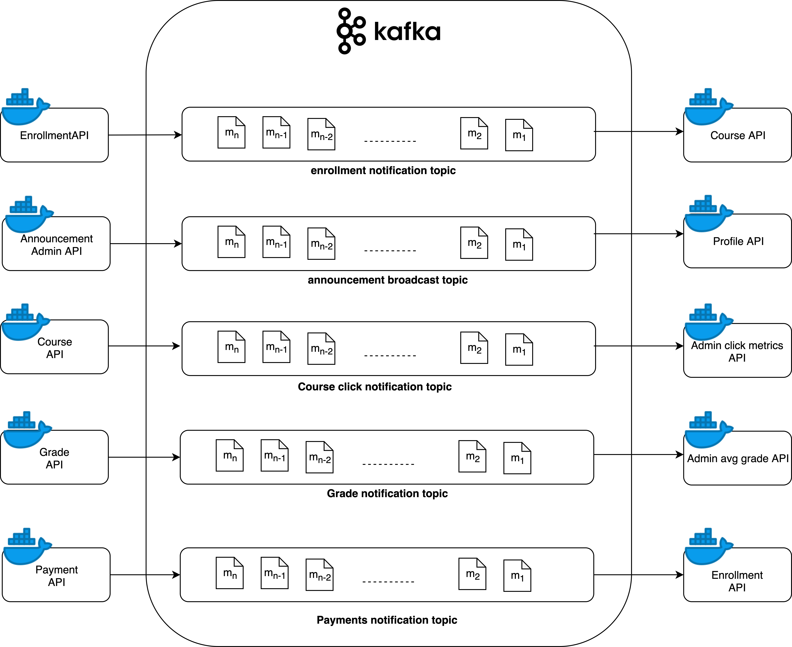

# Architect Award

## High-level CQRS Architecture



**Implementation Details**
* **Go Kafka client:**  - github.com/confluentinc/confluent-kafka-go/kafka
* **Dependency for Go Kafka client:** librdkafka https://github.com/confluentinc/confluent-kafka-go#installing-librdkafka

* **Kafka Topics:** 
  - PAYMENT_TOPIC
    - Consumer: **Enrollment Microservice**, Producer: **Grading Microservice**
    - responsible for notifying enrollment service about successfull fees payment which is mandatory for a student to be graded
  - ENROLLMENT_TOPIC
    - Consumer: **Course Microservice**, Producer: **Enrollment Microservice**
    - responsible for notifying course service about successfull student enrollment which is used to update seat availability for a course
  - GRADES_TOPIC
    - Consumer: **Admin Microservice**, Producer: **Grading Microservice**
    - responsible for notifying admin service about grades received by a student, used for calculating best performing course 
  - ANNOUNCEMENT_TOPIC
    - Consumer: **UserProfile Microservice**, Producer: **Admin Microservice**
    - responsible for notifying user profile service about a new announcement message to be shown to every user. 
  - SEARCH_TOPIC
    - Consumer: **Admin Microservice**, Producer: **Course Microservice**
    - responsible for notifying admin service about a search request for a courses, used for computing course search metrics for adming dashboard
    
**Sample Code in go**
* **Producer :** 
  ```go
  func saveCourseToKafka(course Course) {
	  jsonString, err := json.Marshal(course)

	  courseString := string(jsonString)
	  log.Println("Logging Course Search to kafka CourseID:" + strconv.Itoa(course.CourseID))
	  p, err := kafka.NewProducer(&kafka.ConfigMap{"bootstrap.servers": kafkaServer})
	  if err != nil {
		  logErrorWithoutFailing(err, "Kafka Click producer")
	  }
  
	  // Produce messages to topic (asynchronously)
	  topic := kafkaClickTopic
	  for _, word := range []string{string(courseString)} {
		  p.Produce(&kafka.Message{
			  TopicPartition: kafka.TopicPartition{Topic: &topic, Partition: kafka.PartitionAny},
			  Value:          []byte(word),
		  }, nil)
	  }
  }
  ```
* **Consumer :** 
  ```go
  func ConsumeEnrollmentFromKafka() {
	  log.Printf("Inside StartKafka Consumer")
	  c, err := kafka.NewConsumer(&kafka.ConfigMap{
		  "bootstrap.servers": kafkaServer,
		  "group.id":          "courses_ms_group",
		  "auto.offset.reset": "earliest",
	  })
	  defer c.Close()
	  if err != nil {
		  logErrorWithoutFailing(err, "Kafka Enrollment Consumer")
	  }
	  fmt.Printf("Subscribing to %s topic", kafkaEnrollmentTopic)
	  c.SubscribeTopics([]string{kafkaEnrollmentTopic}, nil)

  	for {
	  	log.Printf("Listening to queue...")
		  msg, err := c.ReadMessage(-1)
  		if err == nil {
	  		// fmt.Printf("Message on %s: %s\n", msg.TopicPartition, string(msg.Value))
		  	log.Printf("Message from kafka %s", string(msg.Value))

			  //retrieve object from message
  			bytes := []byte(string(msg.Value))
	  		var courseEnrollment CourseEnrollment
		  	json.Unmarshal(bytes, &courseEnrollment)
			  // Increment Student Enrollment of course
  			incrementStudentEnrollment(courseEnrollment)
	  	} else {
		  	// The client will automatically try to recover from all errors.
			  fmt.Printf("Consumer error: %v (%v)\n", err, msg)
  		}
	  }
  }
  ```
