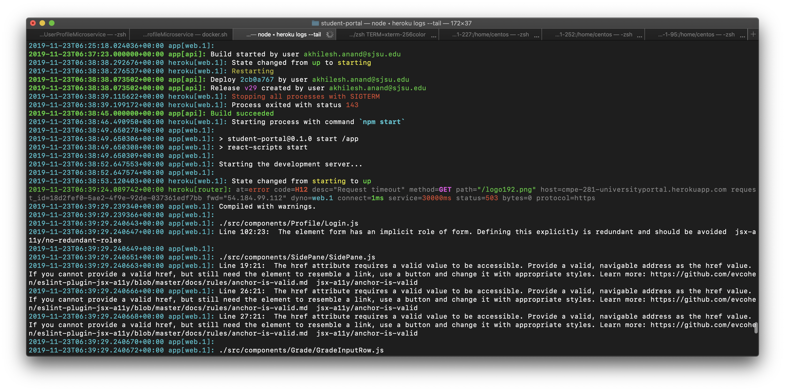
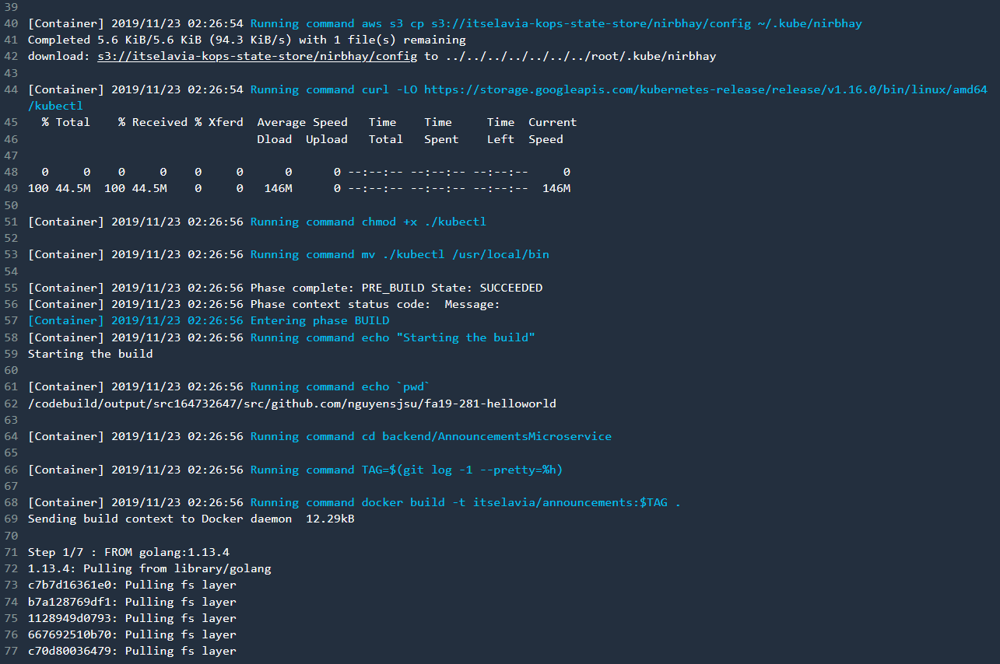

# DevOps Award

## Frontend Countinuous Deployment on Heroku

Heroku is a cloud platform as a service (PaaS).

In our scenario the steps we took to set up Continuous Deployment of Frontend over Heroku were as follows.

1. Create an Application on Heroku.
2. Link Application To Github Repository.
3. Enable Automatic Deployment option.
4. Add new Config Var --> PROJECT_PATH = frontend/student-portal 
5. Add new BuildPack https://github.com/timanovsky/subdir-heroku-buildpack.git and move it to the top of the list.


Step 4 & 5 are additional steps that have to be taken to allow Heroku to monitor only the frontend subdirectory of our application. Doing this ensures that only the frontend code is deployed on Heroku, And redeployments are triggered only where frontend changes are involved.



## Backend Continuous Deployment using AWS CodeBuild

As a commit is pushed to the master branch, AWS CodeBuild clones the repo and starts the build process in the AWS environment. The entire process has 3 phases: pre_build, build, and post_build. The commands for each of these steps need to be added in a buildspec.yaml file which resides in the root directory of the repo:

```
version: 0.2

phases:
  install:
    runtime-versions:
      golang: 1.13
  pre_build:
    commands:
      - echo "Installing and downloading essentials"
      - echo `pwd`
      - mkdir ~/.kube
      - aws s3 cp s3://itselavia-kops-state-store/.kube/config ~/.kube/config
      - aws s3 cp s3://samkops-com-state-store/.kube/config ~/.kube/samarth
      - aws s3 cp s3://itselavia-kops-state-store/nirbhay/config ~/.kube/nirbhay
      - curl -LO https://storage.googleapis.com/kubernetes-release/release/v1.16.0/bin/linux/amd64/kubectl
      - chmod +x ./kubectl
      - mv ./kubectl /usr/local/bin
  build:
    commands:
      - echo "Starting the build"
      - echo `pwd`
      - cd backend/AnnouncementsMicroservice
      - TAG=$(git log -1 --pretty=%h)
      - docker build -t itselavia/announcements:$TAG .
      - echo $DOCKER_HUB_PASSWORD | docker login --username itselavia --password-stdin
      - docker push itselavia/announcements:$TAG

      - cd ../GradingMicroservice
      - TAG=$(git log -1 --pretty=%h)
      - docker build -t samarthkhatwani/grading_ms:$TAG .
      - echo $SAMARTH_DOCKER_HUB_PASSWORD | docker login --username samarthkhatwani --password-stdin
      - docker push samarthkhatwani/grading_ms:$TAG

      - cd ../CoursesMicroservice
      - TAG=$(git log -1 --pretty=%h)
      - docker build -t nirbhayk/courses_ms:$TAG .
      - echo $NIRBHAY_DOCKER_HUB_PASSWORD | docker login --username nirbhayk --password-stdin
      - docker push nirbhayk/courses_ms:$TAG

  post_build:
    commands:
      - echo "Pushing to Kubernetes"
      - cd ../AnnouncementsMicroservice
      - TAG=$(git log -1 --pretty=%h)
      - sed -i "s/VERSION/${TAG}/g" AnnouncementsMicroservice.yaml
      - /usr/local/bin/kubectl apply -f AnnouncementsMicroservice.yaml
      - /usr/local/bin/kubectl get pods

      - cd ../GradingMicroservice
      - sed -i "s/VERSION/${TAG}/g" GradingManifest.yaml
      - /usr/local/bin/kubectl apply -f GradingManifest.yaml --kubeconfig=/root/.kube/samarth
      - /usr/local/bin/kubectl get pods --kubeconfig=/root/.kube/samarth

      - cd ../CoursesMicroservice
      - sed -i "s/VERSION/${TAG}/g" CoursesMicroservice.yaml
      - /usr/local/bin/kubectl apply -f CoursesMicroservice.yaml --kubeconfig=/root/.kube/nirbhay
      - /usr/local/bin/kubectl get pods --kubeconfig=/root/.kube/nirbhay
```

When the build is triggered, you can view the logs of the build process in the AWS CodeBuild console:




### Summary
Created an automatic deployment pipeline using AWS Code Build which pulls backend code from github and builds the Docker image for each micro-service, pushes the image to Docker-Hub and deploys the respective micro-service into individual Kubernetes cluster.

